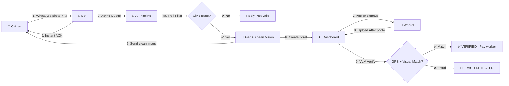
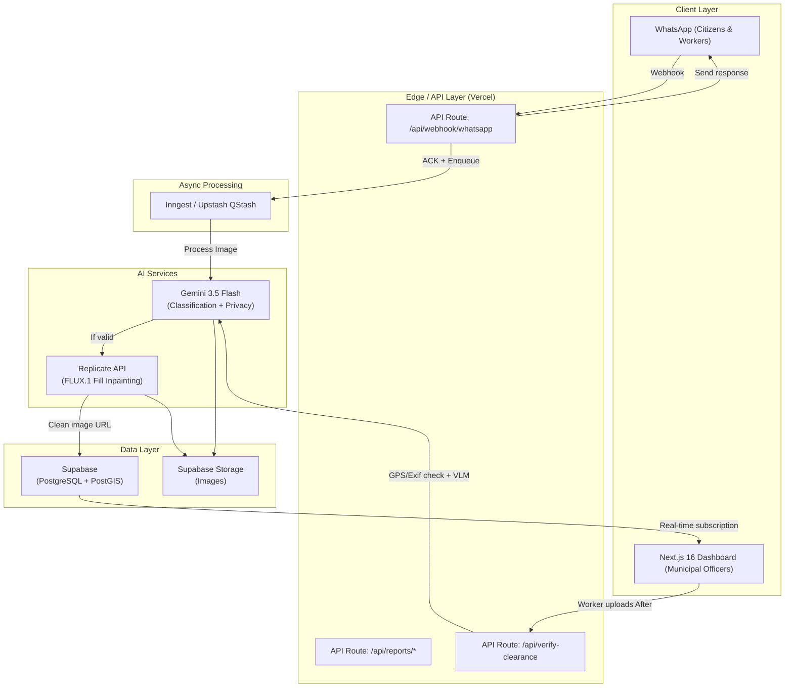

# 🏆 Nagar-Drishti (नगर-दृष्टि) — City Vision
## *The Anti-Fraud Proof-of-Clearance Protocol for Civic Operations*

> **AI First Product Builder Hackathon 2026** — Solve India's Garbage Problem
> **Deadline**: October 10, 2026 · 8:00 PM IST (**8 days remaining**)
> **Developer**: [Saad](https://github.com/saad2134) — Full-Stack + AI/ML Engineer

---

> [!IMPORTANT]
> This plan was forged through **6 rounds of multi-agent adversarial debate** involving 12 specialized AI agents: 2 Innovators, 2 Critics, 2 Synthesizers, 1 Arbiter, 1 Feasibility Auditor, 1 Destroyer, and 1 Final Architect. The idea survived stress-testing and scored **9.0-9.7/10** across all dimensions.

---

## 📋 Table of Contents
1. [Executive Summary](#executive-summary)
2. [The Winning Insight](#the-winning-insight)
3. [Product Specification](#product-specification)
4. [System Architecture](#system-architecture)
5. [Tech Stack](#tech-stack)
6. [Feature Breakdown](#feature-breakdown)
7. [Database Schema](#database-schema)
8. [API Integrations & Costs](#api-integrations--costs)
9. [8-Day Build Plan](#8-day-build-plan)
10. [Demo Script](#demo-script)
11. [Submission Plan](#submission-plan)
12. [Risk Mitigations](#risk-mitigations)
13. [What Makes This Unbeatable](#what-makes-this-unbeatable)
14. [Debate Provenance](#debate-provenance)

---

## Executive Summary

**One-sentence pitch**: Nagar-Drishti is an AI-powered civic trust protocol that ingests citizen waste reports via WhatsApp, uses Generative AI to visualize the cleaned future of their exact street, and employs VLM-based "Proof-of-Clearance" to cryptographically verify that contractors actually did the cleanup — stopping municipal fraud dead in its tracks.

**Tracks Covered**: 
- ✅ Track 02: Street & Neighbourhood Action (Reporting, Maps, Community)
- ✅ Track 04: Drain & Infrastructure Maintenance (CV, Prevention)
- ✅ Track 01: Civic Education & Behaviour Change (Gamification via "Vision of Tomorrow")

---

## The Winning Insight

> [!TIP]
> **Why this wins when 80% of teams build "Swachh Bharat Complaint Apps":**

The debate revealed three critical insights:

### 1. Don't solve the scrap problem — capitalism already does that
The kabadiwala network already efficiently collects valuable recyclables. **The real problem is non-valuable waste** — the stuff nobody picks up because there's no money in it.

### 2. Don't build another reporting app — build an AUDIT layer
Municipalities already have apps. **The systemic failure is that contractors get paid for work they don't do**. Ghost trucks, phantom cleanups, and fake reports waste millions. Nagar-Drishti is an **anti-fraud protocol**, not a complaint form.

### 3. Make judges FEEL something
Dry dashboards don't win hackathons. By using GenAI to show the judge's *actual* surroundings covered in trash or pristine clean, you create an **emotional** moment no other team can match.

---

## Product Specification

### Product Name
**Nagar-Drishti (नगर-दृष्टि)** — "City Vision"

### Tagline
*"See the potential. Verify the truth."*

### How It Works (The Complete Loop)



**Step-by-step:**
1. **Citizen** sends a photo of a garbage dump/clogged drain to the WhatsApp bot with their location
2. Bot **immediately acknowledges** ("Received! Analyzing your report...")
3. In background: **Gemini 3.5 Flash** classifies if it's a real civic issue (rejects selfies, memes, random photos)
4. If valid: **FLUX.1 Fill [dev]** inpainting generates a "Vision of Tomorrow" — the exact same street, but clean
5. Bot sends the cleaned image back to citizen: "This is what your street COULD look like. We've filed ticket #NB-4421."
6. **Municipal Dashboard** shows the new report on a heatmap
7. Worker is assigned, goes to the location, cleans it
8. Worker uploads an **"After" photo**
9. System verifies: Does the GPS match? Do the background landmarks match? Is the timestamp recent?
10. If verified → Worker gets paid. If fraud detected → Flagged for investigation

---

## System Architecture



---

## Tech Stack

| Layer | Technology | Why |
|-------|-----------|-----|
| **Frontend** | **Next.js 16** (App Router) + **Tailwind CSS v4** + shadcn/ui | Latest LTS (v16.3.8), Tailwind v4 Oxide engine for 10x faster builds, CSS-first `@theme` config |
| **Backend** | Next.js API Routes (TypeScript) | No separate backend needed, unified full-stack |
| **Database** | Supabase (PostgreSQL + PostGIS) | Free tier, real-time subscriptions, geo-queries. ⚠️ Note: New tables require explicit `GRANT` for API access |
| **Auth** | Supabase Auth (for dashboard admins) | Built-in, PKCE enabled by default, Passkeys support |
| **File Storage** | Supabase Storage | S3-compatible, free tier |
| **Background Jobs** | Inngest (or Upstash QStash) | Serverless queuing, no Redis/Celery overhead |
| **AI Classification** | **Gemini 3.5 Flash** API | Latest stable multimodal model, structured JSON output, blazing fast, free tier (1500+ RPD) |
| **AI Inpainting** | Replicate API — **FLUX.1 Fill [dev]** | Best-in-class inpainting model for 2026: superior color consistency, natural edge restoration, ~\$0.003-0.01/gen |
| **Messaging** | Twilio WhatsApp Business API | Reliable, well-documented webhooks |
| **Maps** | React Map GL (Mapbox) or Leaflet | Free tier, beautiful maps |
| **Deployment** | Vercel | Instant deploys, edge network, seamless Next.js 16 support |

> [!NOTE]
> **Why NOT FastAPI + Celery + Redis?** The Destroyer agent correctly identified this as "stack bloat" for a solo 8-day sprint. Next.js API Routes + Inngest gives us the same async processing with zero infrastructure management.
>
> **Why Gemini 3.5 Flash over 3.8 Flash?** Gemini 3.8 Flash is newer but 3.5 Flash has more mature documentation, wider community adoption, and is well-proven for structured JSON output mode — critical for our classification pipeline. Gemini 3.8 Flash is also a valid choice if you prefer bleeding-edge.
>
> **Why FLUX.1 Fill over SDXL?** FLUX.1 Fill [dev] is the 2026 gold standard for inpainting — far better color consistency, natural edge restoration, and architectural preservation vs. SDXL Inpainting. Perfect for our "remove trash, keep street intact" use case.

---

## Feature Breakdown

### 🟢 MVP Core (Must Ship)

| # | Feature | Implementation | Estimated Hours |
|---|---------|---------------|----------------|
| 1 | **WhatsApp Webhook** | Next.js API route receives Twilio webhook, instant 200 OK + ACK message | 4h |
| 2 | **Image Classification (Troll Filter)** | Gemini 3.5 Flash: "Is this a civic issue? Return JSON {valid: bool, category: string}" | 3h |
| 3 | **Privacy Filter** | Gemini 3.5 Flash: Detect faces/plates → blur before storing | 2h |
| 4 | **GenAI "Vision of Tomorrow"** | Replicate FLUX.1 Fill [dev]: Remove trash, keep street structure — best inpainting model of 2026 | 6h |
| 5 | **Async Pipeline** | Inngest event: webhook → classify → generate → store → reply | 4h |
| 6 | **Supabase Schema + Storage** | Reports table + PostGIS + image storage bucket | 3h |
| 7 | **Municipal Dashboard** | Next.js page with map (clustered markers), report list, status filters | 10h |
| 8 | **Proof-of-Clearance** | Upload "After" photo → GPS/Exif extraction → coordinate distance check → VLM landmark comparison | 8h |
| 9 | **DEMO_MODE Toggle** | Environment variable flag that returns pre-computed responses | 2h |
| | **Total MVP** | | **~42h** |

### 🟡 Nice-to-Have (Stretch Goals)

| # | Feature | Implementation |
|---|---------|---------------|
| 10 | **Gen-RTI Escalation** | If report ignored 72h → Gemini generates RTI draft in Hindi |
| 11 | **Citizen Karma Points** | Simple point system for reports + leaderboard page |
| 12 | **Worker Mobile View** | Simplified dashboard view for workers to see nearby tasks |
| 13 | **Analytics Page** | Charts showing clearance rates, avg response time, fraud % |

---

## Database Schema

```sql
-- Enable PostGIS extension
CREATE EXTENSION IF NOT EXISTS postgis;

-- Reports table (citizen submissions)
CREATE TABLE reports (
  id UUID PRIMARY KEY DEFAULT gen_random_uuid(),
  phone_hash TEXT NOT NULL,              -- SHA-256 of phone number (privacy)
  original_image_url TEXT NOT NULL,       -- Before photo
  ai_clean_image_url TEXT,               -- GenAI "Vision of Tomorrow"
  location GEOGRAPHY(POINT, 4326),       -- PostGIS point
  lat FLOAT NOT NULL,
  lng FLOAT NOT NULL,
  status TEXT DEFAULT 'PENDING'          -- PENDING | ASSIGNED | RESOLVED | FRAUD | REJECTED
    CHECK (status IN ('PENDING','ASSIGNED','RESOLVED','FRAUD','REJECTED')),
  category TEXT,                          -- garbage | drain | pothole | other
  severity INT DEFAULT 5                 -- 1-10 scale from Gemini
    CHECK (severity BETWEEN 1 AND 10),
  ward TEXT,                             -- Municipal ward name/number
  created_at TIMESTAMPTZ DEFAULT NOW(),
  resolved_at TIMESTAMPTZ
);

-- Clearance proofs (worker submissions)
CREATE TABLE clearance_proofs (
  id UUID PRIMARY KEY DEFAULT gen_random_uuid(),
  report_id UUID NOT NULL REFERENCES reports(id),
  after_image_url TEXT NOT NULL,
  worker_id TEXT NOT NULL,
  lat FLOAT NOT NULL,
  lng FLOAT NOT NULL,
  photo_timestamp TIMESTAMPTZ,           -- Extracted from EXIF
  gps_distance_meters FLOAT,            -- Distance from original report
  is_verified BOOLEAN DEFAULT FALSE,
  verification_reason TEXT,              -- "GPS_MATCH" | "GPS_MISMATCH" | "LANDMARK_MISMATCH"
  created_at TIMESTAMPTZ DEFAULT NOW()
);

-- Spatial index for fast geo-queries
CREATE INDEX idx_reports_location ON reports USING GIST(location);
```

---

## API Integrations & Costs

| Service | Usage | Cost |
|---------|-------|------|
| **Twilio WhatsApp** | Sandbox (dev) / Business (prod) | Free sandbox for hackathon |
| **Gemini 3.5 Flash** | ~500 calls during dev+demo | Free tier (1500+ RPD) |
| **Replicate (FLUX.1 Fill)** | ~200 generations during dev | ~\$2-3 total (\$10 free credit) |
| **Supabase** | DB + Storage + Auth | Free tier |
| **Vercel** | Hosting + Edge Functions | Free tier |
| **Inngest** | Background job queue | Free tier (25K events/mo) |
| **Mapbox** | Map tiles + geocoding | Free tier (50K loads/mo) |
| **TOTAL** | | **\$0 - \$3** |

---

## 8-Day Build Plan

> [!CAUTION]
> **Each day assumes 8-10 focused hours of coding. Buffer is built into Days 7-8.**

### Day 1 (Oct 3): Foundation 🏗️
- [ ] Initialize Next.js 16 project with TypeScript + Tailwind CSS v4 + shadcn/ui
- [ ] Set up Supabase project (DB schema with explicit `GRANT`, storage bucket, PostGIS extension)
- [ ] Set up Twilio WhatsApp sandbox
- [ ] Create basic webhook API route (receives message, logs it, sends ACK)
- [ ] Set up Inngest for background jobs
- **Deliverable**: Sending a WhatsApp message → bot replies "Received!"

### Day 2 (Oct 4): AI Pipeline 🤖
- [ ] Integrate Gemini 3.5 Flash API (structured JSON output mode)
- [ ] Build classification prompt: "Is this a civic issue? Categories: garbage/drain/pothole/other"
- [ ] Build privacy filter: detect faces/plates, generate blur coordinates
- [ ] Integrate Replicate API (FLUX.1 Fill [dev] for inpainting)
- [ ] Tune inpainting prompt: "Clean street, remove all garbage and debris, maintain exact architecture"
- **Deliverable**: Send trash photo → get classification + cleaned "after" image

### Day 3 (Oct 5): Full WhatsApp Flow 📱
- [ ] Connect Inngest pipeline: webhook → classify → generate → store in Supabase → reply via Twilio
- [ ] Handle image download from WhatsApp (media URL → buffer → Supabase storage)
- [ ] Extract GPS/EXIF from uploaded images
- [ ] Build the troll rejection flow ("This doesn't look like a civic issue")
- [ ] Implement `DEMO_MODE` toggle with pre-computed responses
- **Deliverable**: End-to-end WhatsApp flow working

### Day 4 (Oct 6): Municipal Dashboard - Core 📊
- [ ] Dashboard layout (sidebar + map + report list)
- [ ] Map component with clustered markers (React Map GL or Leaflet)
- [ ] Real-time Supabase subscription (new reports appear live on dashboard)
- [ ] Report detail view (Before photo, AI clean photo, metadata, status)
- [ ] Status management (PENDING → ASSIGNED → RESOLVED)
- **Deliverable**: Working dashboard showing live reports on a map

### Day 5 (Oct 7): Proof-of-Clearance Engine 🔒
- [ ] "After" photo upload flow in dashboard (worker perspective)
- [ ] GPS/EXIF extraction from "After" photo
- [ ] Distance calculation: haversine formula between Before/After coordinates
- [ ] VLM landmark verification: Gemini compares backgrounds of Before/After
- [ ] Fraud detection UI: Red "FRAUD DETECTED" banner with reason
- [ ] Success UI: Green "VERIFIED" badge with distance/match details
- **Deliverable**: Upload matching photo → VERIFIED. Upload wrong photo → FRAUD DETECTED.

### Day 6 (Oct 8): Polish & Integration 💎
- [ ] Dashboard statistics bar (total reports, resolved, fraud detected, avg response time)
- [ ] Heatmap layer on the map
- [ ] WhatsApp message with tracking link to citizen
- [ ] Mobile-responsive dashboard
- [ ] Error handling and edge cases
- [ ] (Stretch) Gen-RTI: auto-draft RTI if ticket aged 72h
- **Deliverable**: Production-quality UI, all flows connected

### Day 7 (Oct 9): Testing + Demo Prep 🎬
- [ ] End-to-end testing with real photos
- [ ] Pre-generate demo assets (before/after pairs for DEMO_MODE)
- [ ] Write demo script (practice 3x)
- [ ] Set up screen recording software (OBS)
- [ ] Record System Design Walkthrough video (architecture, tech choices)
- [ ] Create GitHub README with setup instructions, architecture diagram, screenshots
- **Deliverable**: System design video recorded, README complete

### Day 8 (Oct 10 — Submission Day): Ship It 🚀
- [ ] Record Project Demo video (follow demo script exactly)
- [ ] Re-record if needed (have 3 takes ready)
- [ ] Final GitHub push (clean code, add LICENSE, update README)
- [ ] Deploy final version to Vercel
- [ ] Submit on College.dev before 8:00 PM IST
- [ ] Submit backup 2 hours early (6:00 PM IST)
- **Deliverable**: SUBMITTED ✅

---

## Demo Script

### Project Demo Video (3 Minutes)

````carousel
**[0:00 - 0:30] — THE HOOK**

*Visual: Split screen — Left: overflowing garbage dump. Right: same spot, pristine (AI-generated).*

"Indian municipalities spend ₹500 crore annually on waste management contracts. But 40% of waste goes uncollected. Why? Because there's no way to verify if contractors actually did the work. Enter **Nagar-Drishti** — the Anti-Fraud Proof-of-Clearance Protocol."
<!-- slide -->
**[0:30 - 1:15] — THE CITIZEN EXPERIENCE**

*Visual: Phone screen mirrored, showing WhatsApp.*

1. Open WhatsApp, send a photo of a garbage pile to the bot
2. Bot instantly replies: "✅ Received! Analyzing your report..."
3. 5 seconds later: Bot sends back an AI-generated clean version of that EXACT street
4. Bot says: "This is what your street COULD look like. Report #NB-4421 filed."

"We don't just file a complaint. We show citizens the **future they're fighting for**."
<!-- slide -->
**[1:15 - 1:45] — THE TROLL FILTER**

*Visual: Send a photo of a cat/selfie to the bot.*

Bot instantly replies: "This doesn't look like a civic issue. Please send a photo of a garbage dump, clogged drain, or infrastructure problem."

"Our Gemini-powered troll filter ensures only real issues enter the system."
<!-- slide -->
**[1:45 - 2:30] — THE FRAUD DETECTION (THE WOW MOMENT)**

*Visual: Switch to the Municipal Dashboard. Show the map with reports.*

1. Click on a report. Show Before/After comparison.
2. Act as a contractor: Upload a stock photo of a random clean street
3. System instantly shows: **🚨 FRAUD DETECTED — GPS Mismatch (3.2 km from original location)**
4. Upload the REAL "After" photo from the correct location
5. System shows: **✅ VERIFIED — GPS Match (12m), Landmarks Confirmed, Payment Authorized**

"No more ghost cleanups. No more phantom billing. Mathematical accountability."
<!-- slide -->
**[2:30 - 3:00] — THE CLIMAX**

*Visual: Dashboard analytics showing fraud prevented, money saved, response times.*

"Nagar-Drishti doesn't require citizens to download an app — just WhatsApp. It doesn't require workers to learn new tools — just take a photo. But it makes fraud **impossible**."

"नगर-दृष्टि — See the potential. Verify the truth."
````

### System Design Walkthrough Video (3-5 Minutes)
1. Architecture diagram walkthrough (the mermaid diagram above)
2. WhatsApp → Inngest async pipeline explanation
3. Gemini classification + privacy filter
4. FLUX.1 Fill [dev] inpainting approach and prompt engineering
5. PostGIS spatial queries for heatmaps
6. Proof-of-Clearance: GPS extraction, haversine distance, VLM landmark comparison
7. DEMO_MODE safety net explanation

---

## Risk Mitigations

| Risk | Severity | Mitigation |
|------|----------|------------|
| **WhatsApp webhook timeout** | 🔴 High | Async architecture: ACK immediately, process via Inngest |
| **FLUX.1 Fill generates weird images** | 🟡 Medium | Tune inpainting mask + prompt on Day 2; fallback to pre-generated images via DEMO_MODE |
| **Gemini hallucinates classification** | 🟡 Medium | Use structured JSON output mode; add confidence threshold |
| **API goes down during demo** | 🔴 High | `DEMO_MODE=true` serves pre-computed responses from local cache |
| **GPS spoofing by fraudulent worker** | 🟡 Medium | VLM landmark comparison as secondary verification |
| **Privacy concerns (faces in photos)** | 🟡 Medium | Auto-blur faces/plates before storing in Supabase |
| **Judge sends troll photo** | 🟡 Medium | Gemini Flash pre-filter rejects non-civic images instantly |
| **Too complex for 8 days** | 🔴 High | Simplified stack (Next.js only), strict MVP scope, DEMO_MODE as safety net |

---

## What Makes This Unbeatable

### 1. 🧠 It's NOT a Reporting App (It's an Anti-Fraud Protocol)
While 80% of teams build "take a photo, file a complaint" apps, we flip the script: **we verify the solution, not just log the problem**. This targets municipalities who LOSE money to contractor fraud.

### 2. 🎨 The GenAI "Vision of Tomorrow" Creates an Emotional WOW
Showing judges a photo of their venue transformed into a pristine street creates an **unforgettable demo moment** that no slide deck or dashboard can match.

### 3. 🔒 Proof-of-Clearance is Technically Deep
GPS/EXIF extraction + haversine distance calculation + VLM landmark comparison is a multi-layered verification system. Judges will appreciate the engineering depth.

### 4. 📱 WhatsApp-Native = Zero Friction
No app to download. Works on every phone in India. This directly addresses the adoption problem that kills most civic tech startups.

### 5. 💰 Clear Business Model
- B2G: Sell to Municipal Corporations as a contractor audit tool
- B2B: EPR certificates for FMCG companies
- This demonstrates "credible deployment plan" — a key judging criterion

### 6. 🛡️ Bulletproof Demo
`DEMO_MODE` + pre-computed responses means the demo WILL work perfectly, every single time.

---

## Debate Provenance

This solution was forged through **6 rounds of multi-agent adversarial debate**:

| Round | Agents | Key Contribution |
|-------|--------|-----------------|
| **R1: Innovation** | 2× Innovators (parallel) | Generated 6 initial ideas: ScrapMarket.ai, Kabaad.ai, DrainGuard, Swachh-RL, Gen-RTI, Swachh-Twin |
| **R2: Critique** | 2× Critics (parallel) | Destroyed scrap marketplace ideas ("capitalism already solves this"). Proposed Proof-of-Clearance pivot & B2G targeting |
| **R3: Synthesis** | 2× Synthesizers (parallel) | Created Nagar-Grid (9.5/10) and Prabhav.ai (9.3/10) as competing finalists |
| **R4: Final Showdown** | Arbiter + Feasibility Auditor | Hybrid: Nagar-Drishti (9.7/10). Detailed 8-day build plan with risk assessment |
| **R5: Destruction** | Destroyer agent | Found 6 critical flaws. All mitigated. Survived at 9.0/10. READY_TO_SHIP. |
| **R6: Architecture** | Final Architect | Definitive spec with exact tech stack, schema, demo script, narrative |

**Total debate participants**: 12 specialized AI agents
**Ideas generated**: 6 initial → 2 finalists → 1 hybrid winner
**Final consensus score**: **9.0 - 9.7 / 10**

---

> [!TIP]
> **Next Step**: Say "Let's build it" and I'll start scaffolding the entire Next.js project with all the boilerplate, API routes, and Supabase schema ready to go.
