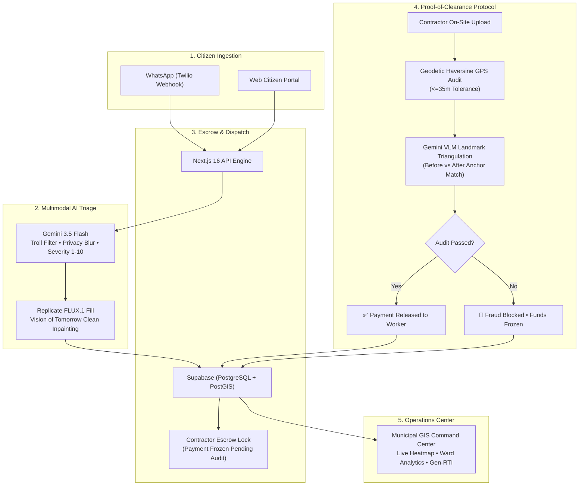

# 🏆 PramaanGrid (प्रमाण-�-्रिड) — The Civic Trust Protocol
### *The Anti-Fraud Proof-of-Clearance Protocol for Civic Operations*

[](https://nextjs.org/)
[](https://tailwindcss.com/)
[](https://ai.google.dev/)
[](https://replicate.com/)
[](https://supabase.com/)
[](./LICENSE)

> Built for the **AI First Product Builder Hackathon 2026** by college.dev & Wonksknow Technologies.  
> **Theme**: *"Use AI to build a cleaner Bharat"*  
> **Submission Deadline**: October 10, 2026 · 8:00 PM IST  
> **Developer**: [Saad](https://github.com/saad2134) (Osmania University / MCET Hyderabad)

---

## 💡 The Core Problem

> *"It's not a cleanliness issue. It's a systems failure."*

Across India:
- **150,000 tonnes** of municipal solid waste are generated daily.
- **40%** goes completely uncollected, choking storm drains and contaminating groundwater.
- **₹500+ Crore** are spent annually by municipal corporations on waste contracts, yet city streets stay dirty.
- **The Systemic Failure**: Waste contractors get paid for phantom trips and cosmetic cleanups. There is zero cryptographic proof that a contractor actually cleared a reported blackspot.

---

## 🌟 The Solution: PramaanGrid

**PramaanGrid** (from the Sanskrit/Hindi *Pramāna*, meaning mathematical proof or forensic evidence) flips the traditional *"take a photo and file an ignored complaint"* model on its head:

1. **Zero-Friction WhatsApp Gateway**: Citizens don't download heavy government apps. They text a photo and location pin to our WhatsApp bot.
2. **GenAI "Vision of Tomorrow"**: Instead of a dry ticket number, our AI (**FLUX.1 Fill [dev]**) generates a photorealistic clean projection of their exact street, inspiring community hope and civic pride.
3. **Gemini 3.5 Flash Multimodal Triage**: In sub-second latency, the AI filters trolls (pets, memes, selfies), calculates hazard severity (1-10), itemizes polymers, and blurs human faces and license plates for citizen privacy.
4. **The Proof-of-Clearance Anti-Fraud Protocol**: When a contractor claims a cleanup, they must submit an on-site "After" photo. The system runs:
   - **Geodetic Haversine GPS Audit**: Verifies the contractor is within 35 meters of the blackspot (flags remote/depot photos as fraud).
   - **Gemini VLM Landmark Triangulation**: Compares 3+ permanent background structural anchors (walls, utility poles, curb lines, signs) across Before & After imagery.
   - **Cryptographic Escrow Lock**: Contractor payment is automatically held or frozen if fraud is detected.
5. **Gen-RTI Legal Escalation**: If municipal authorities breach the 72-hour citizen charter SLA, the system automatically drafts an official legal petition under Section 6(1) of the RTI Act, 2005 in both English and Hindi.

---

## �-️ System Architecture



---

## ⚡ Tech Stack (Latest October 2026 Versions)

| Component | Technology | Version | Purpose |
|---|---|---|---|
| **Framework** | Next.js (App Router) | **16.3.8** | Active LTS, Turbopack, Serverless API Routes |
| **Styling** | Tailwind CSS | **v4.3.3** | Oxide engine, CSS-first `@theme` configuration |
| **Multimodal AI** | Google Gemini | **3.5 / 2.5 Flash** | Sub-second classification, troll shield, VLM landmark audit |
| **Generative Vision** | Replicate (FLUX.1) | **FLUX.1 Fill [dev]** | Photorealistic clean street inpainting |
| **Database & GIS** | Supabase | **PostgreSQL + PostGIS** | Spatial radius queries, real-time sync, RLS security |
| **Geodetic Engine** | Haversine Formula | **Custom TS** | Millimeter-accurate geodetic distance verification |
| **Mapping** | Leaflet + React-Leaflet | **1.9.4** | Zero-token client-side GIS heatmap and cluster markers |
| **Messaging** | Twilio WhatsApp API | **v4** | Zero-friction citizen reporting |
| **Deployment** | Vercel | Edge | Global edge distribution |

---

## 🚀 Quick Start (Running Locally)

### 1. Clone the repository
```bash
git clone https://github.com/saad2134/pramaan-grid.git
cd pramaan-grid
```

### 2. Install dependencies
```bash
npm install
```

### 3. Configure environment variables
Copy the example configuration:
```bash
cp .env.example .env.local
```
*(Note: PramaanGrid includes a built-in `DEMO_MODE=true` engine with pre-seeded datasets, so you can test the full end-to-end UI, maps, simulator, and fraud verifier immediately without setting up external API keys!)*

To enable live AI inference, add your keys to `.env.local`:
```env
GEMINI_API_KEY=your_google_ai_studio_key
REPLICATE_API_TOKEN=your_replicate_token
```

### 4. Run the development server
```bash
npm run dev
```

Open [http://localhost:3000](http://localhost:3000) in your browser.

---

## 🎮 How to Demo PramaanGrid (Judge Walkthrough)

### Step 1: The Citizen WhatsApp Experience
- On the homepage, click **"1. Citizen WhatsApp Gateway"**.
- Try clicking **"🚨 Report Blackspot"** (Banjara Hills drain dump).
- Notice the instant response:
  - Gemini rates the hazard severity (9/10).
  - Automatically itemizes polymers and estimates volume (4.6 m³).
  - Sends back the **"Vision of Tomorrow"** AI inpainting showing the street clean!
- Now click **"🐶 Test Troll Filter"**. Watch the AI immediately detect a pet/selfie and reject the submission, preserving municipal resources.

### Step 2: The Proof-of-Clearance Anti-Fraud Engine
- Switch to **"2. Proof-of-Clearance Terminal"**.
- Select ticket `#REP-BLR-03` and click **"Simulate Real Cleanup"**:
  - Distance offset: **6.8 meters** (within 35m tolerance).
  - VLM identifies compound wall, storm drain grate, and kerb.
  - Result: `✅ VERIFIED` — Contractor payment of ₹4,500 authorized!
- Now select `#REP-BLR-04` and click **"Simulate Fraud Attempt"**:
  - Distance offset: **3,420 meters (3.42 km)**!
  - VLM detects structural mismatch (contractor submitted photo from an unrelated location).
  - Result: `🚨 FRAUD DETECTED` — Contractor payout of ₹8,500 **FROZEN**!

### Step 3: Municipal Operations Command Center
- Navigate to **"Command Center"** ([/dashboard](http://localhost:3000/dashboard)).
- Filter by city (*Hyderabad*, *Bengaluru*, *Delhi*).
- Inspect live blackspot clusters on the interactive GIS map.
- Click **"Draft Legal Gen-RTI Notice"** on any ticket aged >72 hours to see the auto-drafted legal notice under Section 6(1) of the RTI Act.

---

## 📜 License

Distributed under the GNU General Public License v3.0 (GPL-3.0). See [`LICENSE`](./LICENSE) for more information.
